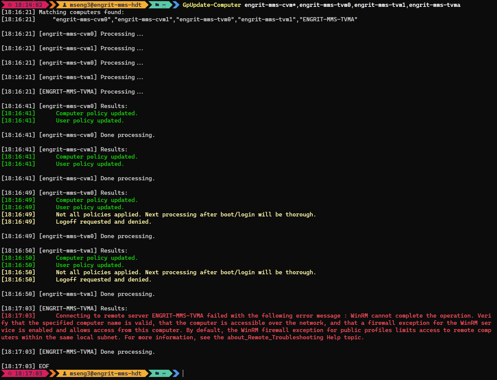

# Summary
Custom module for silently and asynchronously running `gpupdate /force` on one or more remote computers.  

I find this to be more useful than using GPMC or MECM/RCT because those are generally some combination of not silent (can display a console window for logged-in users), not instantaneous, and not reliable.  

# Usage
1. Download `GpUpdate-Computer.psm1` to the appropriate subdirectory of your PowerShell [modules directory](https://github.com/engrit-illinois/how-to-install-a-custom-powershell-module).
2. Run it using the examples and parameter documentation below.

# Example
```powershell
GpUpdate-Computer "mel-101-*","eh-201-*"
```



# Parameters

### -Queries \<string[]\>
Required string array.  
One or more strings representing computer names or wildcard queries for computer names to be searched for in AD.  
Only matching computers found in AD (under the given `-SearchBase`) will be acted upon.  

### -SearchBase \<string\>
Optional string.  
The OUDN of an OU under which to limit the AD search for `-Queries`.  
Default is `OU=Engineering,OU=Urbana,DC=ad,DC=uillinois,DC=edu`.  

### -ThrottleLimit \<int\>
Optional integer.  
The maximum number of machines to connect to and process simultenaously (asynchronously).  
Default is `50`.  

### -FullOutput
Optional switch.  
By default, for readability the responses returned from the remote computers are translated from their verbose language into more simplified statements, and irrelevent statements or informational info is omitted.  
When `-FullTimeout` is specified, the responses are returned in full and unaltered (except for the removal of blank lines).  

### -NoColor
Optional switch.  
By default, for readability, standard/recognized repsonses from the remote computers are colorized based on their implications.  
For example, `Computer Policy update has completed successfully.` and similar messages are colored green, warnings and informational responses are colored yellow, and errors are colored red.  
When `-NoColor` is specified, no colorization is performed.  

### -Credential \<PSCredential\>
Optional PSCredential object.  
The module works by implementing the `Invoke-Command` cmdlet to connect to remote computers.  
If specified, the given PSCredential will be passed to `Invoke-Command` as its `-Credential` parameter.  
Otherwise, the current PowerShell user's credentials will be used, per default `Invoke-Command` behavior.  
Useful if you want to connect and run the command as a superuser account, or local admin account.  

# Notes
- By mseng3. See my other projects here: https://github.com/mmseng/code-compendium.